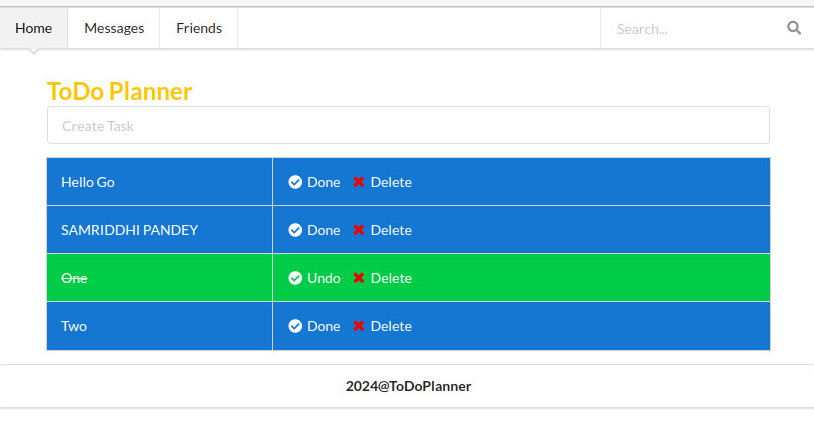

# ToDo Planner

This app is for those who is learning the react, axios and semantic ui. It is powered by microservice for data handling which you can find in [Planner-Service repository](https://github.com/BishnuPandey/Planner-Service.git). Make sure to run service before along with front end.

## Run the project

Clone the repo. Then in the project directory, run:

```
> git clone git@github.com:BishnuPandey/Planner-Frontend.git
> cd /your_folder_path
> npm start
```

Runs the app in the development mode.
Open [http://localhost:3000](http://localhost:3000) to view it in your browser.



